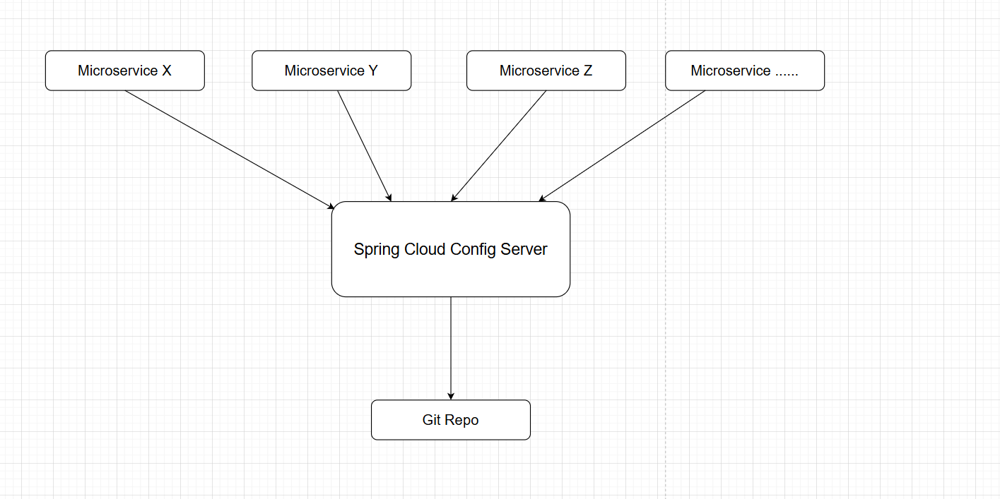
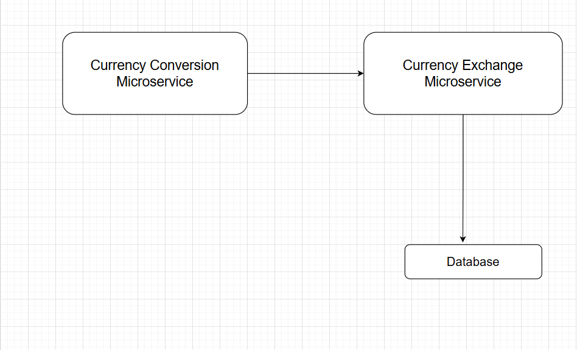
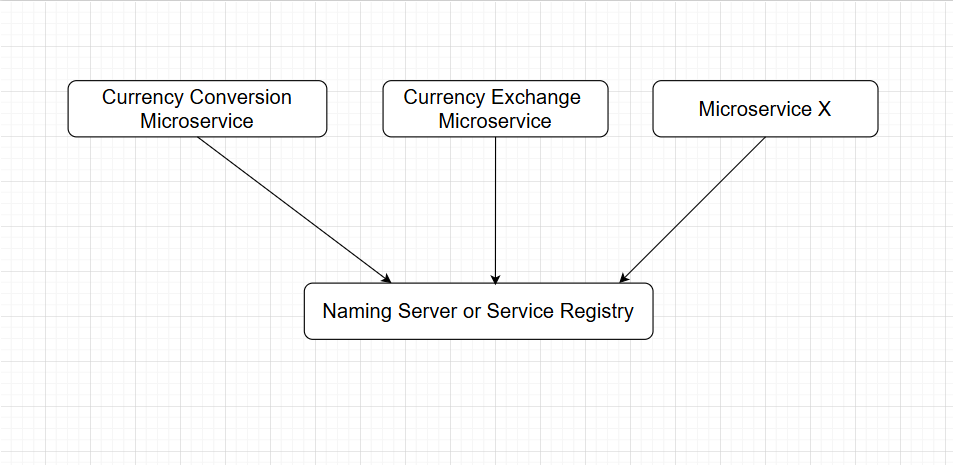
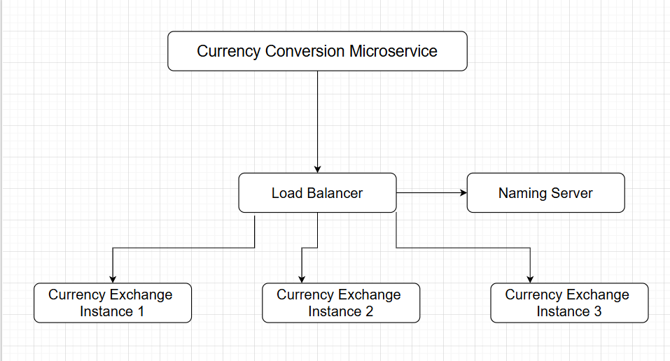
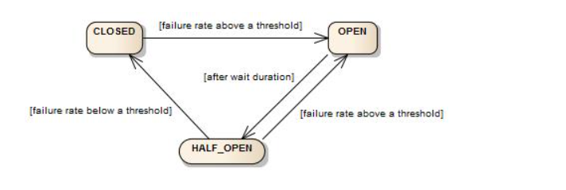

# Microservice-With-Spring-Cloud
This project is to explore the basic of Microservice and learn how to implement microservice using Spring Cloud, including:
* Establish communication between microservices
* Enable load balancing
* Centralize the configuration of microservices with Spring Cloud Config Server
* Implement Eureka Naming Server
* Create fault tolerance microservices with Resilience4j

## Monolith Application

- A large application might only have one database
- Challenges
  - Deployment complexity: Minor updates need complete redeployment
  - Tightly coupled components: Changes in one part of application can affect others => longer release cycles
  - Scalability limitations: Scaling can be resource intensive, entire app to be scaled even if only one part of it needs more capacity
  - Technology lock-in: Entire app built on a single technology stack, adopting new technologies is challenging.

## Microservice

- Small autonomous services that work together - Sam Newman
- The microservice architectural style is an approach to developing a single application as a suite of small services, each running in
  its own process and communicating with lightweight mechanisms, often an HTTP resource API. These services are built around business
  and independently deployable by fully automated deployment machinery. There is a bare minimum of centralized management of these services,
  which may be written in different programming languages and use different data storage technologies.
- Three critical focus areas
  - REST: Built following REST API Standards and Best Practices
  - Small Well Chosen Deployable Units: independently deployable units of small services
  - Dynamic Scaling: Possible to scale up and down independent of each other
- Example: Movie Booking Application - key microservices
  - Movie Service: Central service managing moving details, show times, and availability
  - Booking Service: Handles ticket booking, seat selection, and booking management
  - Pricing Service: Manages ticket pricing, discounts, and special offers
  - Customer Service: manages customer profiles, authentication, and customer support
  - Review Service: Allows users to submit and view reviews, ratings, and comments.
- Three key advantages
  - New technology and process adoption: Teams can adopt new technologies and processes for individual services
    - Flexibility: Choose the best framework, and languages for each service
    - Innovation: Easier to experiment and use emerging technologies
  - Dynamic Scaling: Enable scaling of individual components based on demand
    - Efficiency: Scale only the service that need it, reducing costs
  - Faster release cycles: Smaller, independent services can be developed, tested, and deployed more quickly
    - Agility: Allows for more frequent updates and quicker response to market demands
- Key microservices solutions

  - Spring Boot: Enables rapid development of REST API
  - Spring Cloud: Umbrella project that provides essential microservice needs
    - Centralized Configuration: Manage configuration for multiple microservices in central GIT repository
    - Load Balancing: Distributes requests across active instances of microservices dynamically
    - Service Discovery: Enable automatic discovery of microservices
    - Distributed Tracing: Trace requests across microservices
    - Edge Server: Single Entry Point - Implement common features like authentication
    - Fault Tolerance: Ensure that failure in one microservice does not cascade and make other microservices to fail.
  - Docker: Consistent deployment approach for microservices, programming language and environment independent
  - Kubernetes: Orchestrate thousands of microservices with advanced features (Service Discovery, Load Balancing, Release Mgmt,...)

## Centralized Configuration

- Need for Centralized Configuration
  - Lot of configuration:
    - External Service
    - Database
    - Queue
    - Typical Application Configuration
  - Configuration variations:
    - 1000s of Microservices
    - Multiple Environments
    - Multiple instances in each Environment
- How to manage all this configuration (Spring Cloud Config Server)
  - Store configuration related multiple microservices, all the different environment in just one git repo.
  - Create a microservice limits-service - Config Client and import config server
    - spring.config.import=optional:configserver:http://localhost:8888
  - Create another microservice spring-cloud-config-server - Config Server
  - Initialize a git repo, and create a configuration file - limits-service.properties
  - Set the uri of config server in spring-cloud-config-server
    - spring.cloud.config.server.git.uri=file:///C:/Users/**\***/Desktop/GitFolder/microservice-with-spring-cloud
  - Enable config server - @EnableConfigServer
  - Ensure the microservice name should be the same as the name of properties files in git repo
    - spring.application.name=limits-service
  - Set configuration for different environments
    - spring.profiles.active=dev
    - spring.cloud.config.profile=dev
    - create corresponding file in git repo - limits-service-dev.properties
      

## Example of Microservice Architecture

- Microservice Overview: 
- Currency Exchange Microservice - the exchange rate of one currency in another
  - http://localhost:8000/currency-exchange/from/USD/to/CNY
  - {"id":10001, "from":"USD", "to":"CNY", "conversionMultiple":7.19, "environment":"8000 instance-id"}

* Currency Conversion Microservice - convert the USD into CNY
  - http://localhost:8100/currency-conversion/from/USD/to/CNY/quantity/10
  - {"id": 10001, "from": "USD", "to": "CNY", "conversionMultiple": 7.19, "quantity": 10, "totalCalculatedAmount": 71.9, "environment": "8000 instance-id"}
  - Invoke currency exchange service from currency conversion service using RestTemplate: https://github.com/GongVictorFeng/microservice-with-spring-cloud/commit/9a30bc56109b118ad4b0ba547e13f970d1bf890f
  - Use Feign Rest client for service invocation: https://github.com/GongVictorFeng/microservice-with-spring-cloud/commit/f0b713a76a778affcfa376e063b3380a34149edc

- Naming Server: In microservice architecture, all the instances of all the microservices would register with a service registry
  - Currency Conversion Microservice would talk to Naming server to get the address of Currency exchange microservice, then it can send the request to currency exchange microservice 

* Load Balancing: Dynamically launch currency exchange instance and distribute load between them
  - As instances come up and go down, they should be automatically discovered and load balance between them:
  * Use Eureka, see implementation:
    - https://github.com/GongVictorFeng/microservice-with-spring-cloud/commit/c7b3f6a30bddcb9c51dd8ac6fe7359cb406c4104
    - https://github.com/GongVictorFeng/microservice-with-spring-cloud/commit/3e74c35bcc9886b96e166f9fc60ccbba295acc41
    - https://github.com/GongVictorFeng/microservice-with-spring-cloud/commit/cbd41dbadab87203d7e79c8ec6e40ee4706c7cbc
* API Gateway
  - Microservices have many common features such as rate limiting, authentication and authorization
  - Implement common features in common place
  - Before call any microservice, route every request through a API gateway
  - Spring Cloud Gateway:
    - Simple, yet effective way to route to APIs
    - Provide cross cutting concerns;
      - Security
      - Monitoring/metrics
    - Built on top of Spring WebFlux (Reactive Approach)
    - Features:
      - Match routes on any request attribute
      - Define Predicates and Filters
      - Integrates with Spring Cloud Discovery Client (Load Balancing)
      - Path Rewriting
    - Enable Discovery locator with Eureka for Spring Cloud Gateway:
      - https://github.com/GongVictorFeng/microservice-with-spring-cloud/commit/bac22dd5abdc85c2a7c3d99b9c3d7c084d75a88d
      - https://github.com/GongVictorFeng/microservice-with-spring-cloud/commit/d1a033857a91236b0bf430912f3dfe095896363b
    - Implement the feature of customize route: https://github.com/GongVictorFeng/microservice-with-spring-cloud/commit/6657f1f0c3d942699d4434232b80da8a5c366d5c
    - Implement the feature of global filter: https://github.com/GongVictorFeng/microservice-with-spring-cloud/commit/2823f35cebbe65cd79fc6c69529198c7ccd538ce
* Fault Tolerance - Resilience4j
  - In microservice architecture, there is a complex call chain:
    - Microservice1 -> Microservice2 -> Microservice3 -> Microservice4 -> MicroserviceX
  - What if one of the services is down or is slow?
    - Impacts entire chain
  - Questions:
    - how to return a fallback response if a service is down
    - how to implement a Circuit Breaker pattern to reduce load
    - how to retry requests in case of temporary failures
    - how to implement rate limiting
  - Solution: Circuit Breaker Framework - Resilience4j
  - Implement retry and fallback method: https://github.com/GongVictorFeng/microservice-with-spring-cloud/commit/78870a5da779acf04ffed4432bd96af1f9aaac3e
  - Implement CircuitBreaker: https://github.com/GongVictorFeng/microservice-with-spring-cloud/commit/ad51b9542db2b223583584e20803b02b4f408883
    - A circuit breaker can have three different states: closed, open, half_open.
    - close: when calling the dependent microservice continuously
    - open: not call the dependent microservice, directly return the fallback response.
    - half_open: send a percentage of requests to the dependent microservice, the rest of the request will return the fallback response.
    - state changing: 
  - Implement rate limiting and bulkHead: https://github.com/GongVictorFeng/microservice-with-spring-cloud/commit/e925b79061d207062aba80c1d94426037d3aea6b
